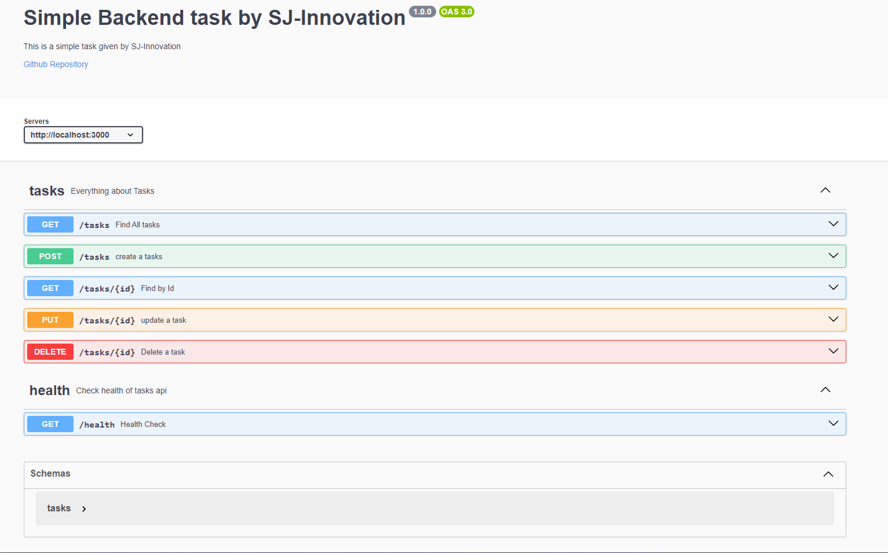

# Simple Task Api

Simple Task Api implementation given by SJ-innovation


## Installation

To install this project in your local machine you have to clone this repository first


```bash
  git clone https://github.com/iam-MustakAhmedKhan/sj-task1 my-project
  cd my-project
  npm install
  npm start
```
    
## Environment Variables

To run this project, you will need to add the following environment variables to your .env file

`MONGO_CONNECTION_STRING`

`PORT`


## Documentation

after successfully install this repo . can test the api with swagger Documentation

```http
GET /docs/v1
```


## API Reference

#### **Check Health**


```http
GET /health
```

#### **Post a Task**

```http
POST /tasks
```

| Body | Type     | Description                       |
| :-------- | :------- | :-------------------------------- |
| `title`      | `string` | **Required**. Title is required to creating a task |
| `Description`      | `string` | **Required**. Description is also required to creating a task |

#### **Get all Tasks**

```http
GET /tasks
```


#### **Get Single Tasks**

```http
GET /tasks/${id}
```

| Parameter | Type     | Description                       |
| :-------- | :------- | :-------------------------------- |
| `id`      | `string` | **Required**. Id of task to fetch |

#### **Update a Task**

```http
PUT /tasks/${id}
```

| Parameter | Type     | Description                       |
| :-------- | :------- | :-------------------------------- |
| `id`      | `string` | **Required**. Id of task to update |

| Body | Type     | Description                       |
| :-------- | :------- | :-------------------------------- |
| `title`      | `string` | Task Title |
| `description`      | `string` | Task description |
| `status`      | `string` |  complete / incomplete |


#### **Delete a Task**

```http
DELETE /tasks/${id}
```

| Parameter | Type     | Description                       |
| :-------- | :------- | :-------------------------------- |
| `id`      | `string` | **Required**. Id of task to delete |


## Tech / Libraries
**Server:** Node, Express

**Libraries:** mongoose, nodemon, swagger-ui-express, yamljs, dotenv, cors


## Author

- [@iam-MustakAhmedKhan](https://github.com/iam-MustakAhmedKhan)

